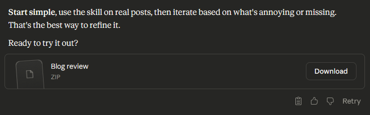

Anthropic recently released [Claude Skills](https://www.anthropic.com/news/skills). This post will show you how to create and implement a concrete skill for Claude Code (rather than the website). As an example I will use a skill which I created, to help review this particular blog post (and all future blog posts).

## Creating a new skill
The simplest skill you can create is a single markdown file, placed inside the folder `.claude/skills/{your-skill-name}/skill.md`. A skill can also contain helpful assets, like small scripts it can use.

**How do you create a skill?**

You could write it yourself, but for your first skill I suggest getting some AI help.
1. Open the [Claude website](https://claude.ai).
2. Go to `Settings` → `Capabilities` and scroll down to `Skills`.
3. There are several pre-configured skills. Enable the one called `skill-creator`.
4. Click the `•••` and select **Try in chat**.
5. Tell Claude what kind of skill you want. You can see the example I used below.

**Prompt**
```
I want to create a new skill for Claude Code for my blog. I still want 
to write the blog posts myself, but I want to use Claude Code to review 
them.

The blog is written as a Hugo static site and published via Github pages. 
It's about technical topics within software development. I aim to provide 
relatively short posts with concrete tips that help users in their 
everyday work.

I need a skill to review my blog posts. Can you help create that?
```
Claude will generate a skill bundle (zip file) that you can download.



## Implementing the skill in Claude Code
Once you have downloaded the zip-file you can implement it either globally or for a specific project:
1. Globally → `%USERPROFILE%/.claude/skills/`
2. Project → `{path-to-your-project}/.claude/skills/`

Adjust accordingly if you are using MacOS or Linux.

The skill will be packed in a folder inside the zip file, so don't create the folder for the skill manually. Just extract the zip file inside the `skills` folder.

## Using the skill
Once the skill is implemented, you need to restart Claude Code. After that, Claude Code will automatically use the skill if you ask it a question where the skill is relevant. So I'll ask it to review my post.

**Prompt**
```
Can you please review the blog post `content\posts\automating-blog-reviews-with-claude-skills\index.md`?
```

This should trigger the skill. Claude Code will explicitly write in the terminal when a skill is triggered. You sometimes have to explicitly remind Claude that it has a specific skill, but most of the time it figures out on its own.

## Maintaining skills
Most likely your skill description won't be perfect from the first attempt. So don't be afraid to edit your skill documents. In particular, if you see a specific skill behaving in a way you didn't expect, go read the skill document and see if you can find out why. And then update the skill document, so that it won't happen again.