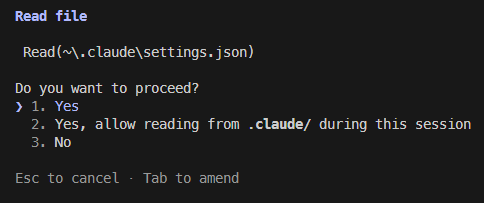

> ℹ️ This is the first post in a series on configuring Claude Code. We'll cover permissions, `CLAUDE.md` and rules, and building custom skills.

The reason we start with permissions - and not `CLAUDE.md` as you often see - is that permissions (or lack of them) are where the most friction comes from.

> ℹ️ *Updated April 2026 — see [the update at the bottom](#update-april-2026) for two new tools that have changed how I manage permissions.*

## What are permissions?

Claude Code is programmed to only perform very few tasks, without first asking for your permission. This means that you will quite often see it ask something like this:



This protects you from unintended actions, but the defaults are restrictive enough to interrupt your flow. You can configure permissions so Claude rarely asks, while still blocking what you don't want. The simplest way is the "Always allow" option shown above — but it may not be the best.

## Where are permissions located?

Permissions are configured in files called `settings.json` and follow the same structure as everything else in Claude Code. The blog post [Anatomy of the .claude/ folder](https://blog.dailydoseofds.com/i/191853914/anatomy-of-the-claude-folder) does a great job of describing this (you only have to read the first section). But in short permissions can be set on **project level** or **user level**. And for the project level, there is both a tracked and an untracked version, which is quite important if you work in a team. So that is a total of 3 settings files for any given project.

**User level**

```
~/.claude/
└── settings.json ← All projects, only you
```

**Project level**
```
your-project/.claude/
├── settings.json ← Specific project, all users
└── settings.local.json ← Specific project, only you
```

The files only differ in when they are applied, not how they work. 

## How do the settings files work?

A typical `settings.json` file looks something like this:

```json
{
  "permissions": {
    "allow": [
      "Bash(mv \"content/posts/automating-blog-reviews-with-claude-skills.md\" \"content/posts/automating-blog-reviews-with-claude-skills/index.md\")",
      "Bash(hugo *)",
      "WebSearch",
      "WebFetch(domain:gohugo.io)",
      "WebFetch(domain:github.com)",
      "Bash(git *)",
      "Bash(winget search *)",
      "Bash(winget install *)"
    ],
    "deny": [],
    "ask": []
  }
}
```

This example is from my `settings.local.json` file for this blog. So the one not being tracked by Git. It has the sections **deny**, **ask** and **allow**. I listed them in the order they are applied. So if something is listed in both **deny** and **ask**, it will be denied. This leads us to the first tip:

> 💡 Use the "deny" list to prevent Claude Code from running undesired commands

Another thing to notice in the example, is the first line. It looks weird and very specific. That is because I used the option to "Always allow" when Claude asked me, rather than write it myself in the list. And that is the second thing I want to emphasize. Manually maintaining the permissions list is more work (initially at least), but it yields much better results. Which leads us to the next tip:

> 💡 Prefer manually modifying `settings.json` - instead of using the "Always allow" option from the prompt

Manually maintaining your settings files will allow you to set just the right boundaries for Claude to a point where it (almost) never has to ask for permission. And when it does, you will take it more seriously, than when you get asked every other prompt.

And if you have already used the "Always" allow option in the prompt, don't worry. That option simply adds a line to the projects `settings.local.json` file, where you can remove it again.

## How do I build a good list of permissions?

Permissions, while reducing friction, can increase risk. So exactly where the line should be drawn, depends on the individual developer and the specific project. There is no single right answer!

There is however, a single (almost) universal rule. Which leads us to another tip:

> 💡 Always manage project scoped permissions in `settings.local.json` (the one that is not tracked by Git)

This has almost no downsides, it only means that new developers have to configure their own `settings.local.json` file, once they are onboarded. But this is a one time thing. The benefit is that it helps mitigate risk. If permissions have become too relaxed, they aren't automatically transferred to other developers. In other words, the impact of adding a "wrong" line to permissions, is limited.

That means that the choice, when adding a new permission, is whether it should be user or project scoped. The answer to which, will almost always be the classical developer answer: "It depends". A good starting place is to ask yourself if this command is one you exclusively use in the specific project. If it is, and if you find it safe, you can add it to the **allow** list in `settings.local.json`. Or likewise add a command you don't trust, to **deny**. Often though, you will find that it is a command you need in all projects. Things like `git` and `dotnet` are rarely limited to use in a single project, so I prefer to add them to my user level `settings.json` file.

> 💡 Always start by considering if a new permission can be limited to a specific project

## Adding new permissions

Once you have decided *where*, the next step is *how*. Let's say for example we want to allow Claude to use `git`, except for deleting branches, in which case you want it to ask. And it should apply to all projects (user level). For that we need to add two lines to `~/.claude/settings.json`:

```json
{
  "permissions": {
    "allow": [
      "Bash(git *)"
    ],
    "ask": [
      "Bash(git branch -D *)"
    ],
    "deny": []
  }
}
```

The `*` is a wildcard, meaning that all commands which start with `git` (followed by a space) will be allowed. But remember that **ask** is evaluated before **allow**, so anything starting with `git branch -D` will require Claude to ask, despite it matching both patterns.

## Building iteratively

The last advice for this post, is to build these lists iteratively. Whenever Claude asks you for permission to execute a command, stop and read exactly what it asks. If it's something you want to always allow, either at project level or user level, open the relevant settings file and add a line which matches the command. Use the wildcard symbol (`*`) to avoid overly specific permissions, like the first permission in the first example. It will slow you down initially, but as your permissions become increasingly precise to your specific need, it will boost your development speed greatly.

---

For the full reference on permission rules, modes, and syntax, see the [official Claude Code permissions documentation](https://code.claude.com/docs/en/permissions).

## Update: April 2026

Since publishing, Claude Code has introduced two new tools for permission management.

**[Auto mode](https://code.claude.com/docs/en/permission-modes#eliminate-prompts-with-auto-mode)** almost eliminates permission requests. You can enable it by running `claude --permission-mode auto`. It's like a smarter version of the `bypassPermissions` flag. I often use it, but with care — it's powerful, so combine it with guard rails like frequent git commits and not committing directly to main.

**Fewer permission prompts** is a skill that was recently added. You run `/fewer-permission-prompts` in the Claude Code CLI. It will go over recently used commands (ironically asking for permission during the process) and try to identify low-risk commands often used and suggest adding them to the `allow` list in your settings file. I still prefer to manage my settings files manually, but it can be useful for detecting commands you may have forgotten to add.